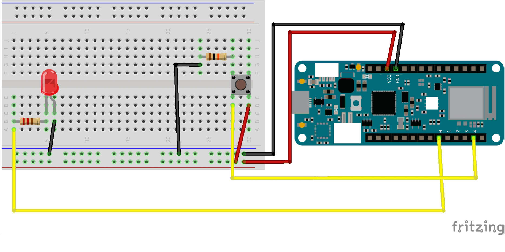
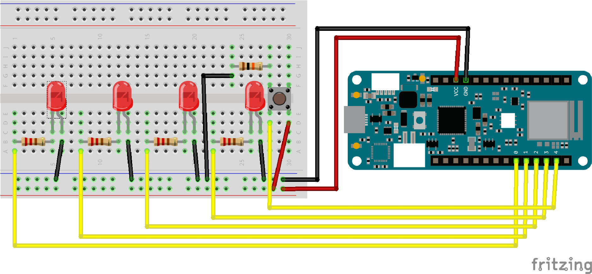

# Step 1

You need the following materials to setup the breadboard:
- 1 LEDs
- 1 220 ohm resistors
- 1 10K ohm resistor
- 1 Button
- 3 black wires
- 2 red wires
- 2 yellow wires (or any other color you have)
- 1 breadbord

# Step 2

# Step 3

You need the following materials to setup the breadboard:
- 2 LEDs
- 2 220 ohm resistors
- 1 10K ohm resistor
- 1 Button
- 4 black wires
- 2 red wires
- 3 yellow wires (or any other color you have)
- 1 breadbord

# Step 4

You need the following materials to setup the breadboard:
- 4 LEDs
- 4 220 ohm resistors
- 1 10K ohm resistor
- 1 Button
- 5 black wires
- 2 red wires
- 5 yellow wires (or any other color you have)
- 1 breadbord

