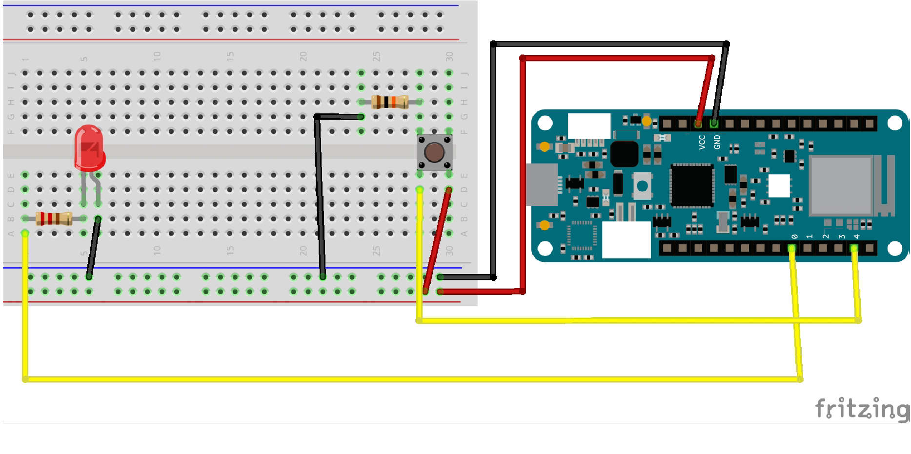
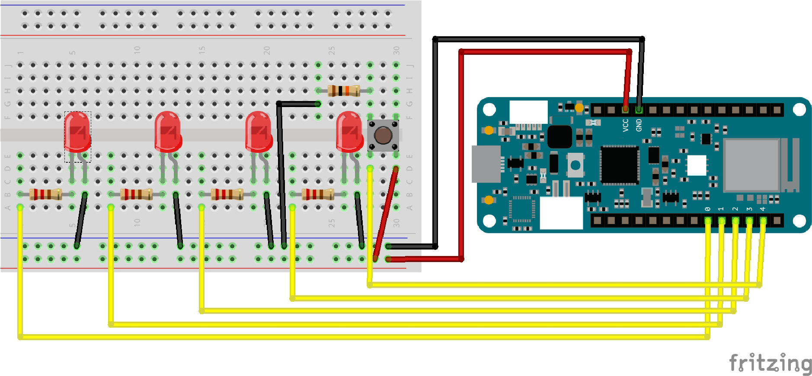

# Step 1

You need the following materials to setup the breadboard:
- 1 LEDs
- 1 220 ohm resistors
- 1 10K ohm resistor
- 1 Button
- 3 black wires
- 2 red wires
- 2 yellow wires (or any other color you have)
- 1 breadbord

**Go to https://github.com/PamelaAnne/SocialRobot to grab your Arduino code:**

Download the code with the green button in the top right corner and use the folder **StepByStepBasic_LEDS** and use file **ButtonLedNoMQTT**.

When you connect your Arduino and open the code, you first compile the code and then upload it on your Arduino. Now you need to be able to switch on the light of the LED on and off with the button.

This code doesn't use yet the MQTT broker Shiftr.io and WiFi network

# Step 2

Use now in the same folder the file **ButtonLed**.

When you connect your Arduino and open the code, you first compile the code and then upload it on your Arduino. Now you need to be able to switch on the light of the LED on and off with the button, but it now it first signals through the MQTT broker of Shiftr.io

This code does use the MQTT broker Shiftr.io and WiFi network.

See [Shiftr.io explained](https://github.com/PamelaAnne/SocialRobot/blob/master/Pages/Shiftr.ioExplained.md) to know what this means and how to set this up.

# Step 3

You need the following materials to setup the breadboard:
- 2 LEDs
- 2 220 ohm resistors
- 1 10K ohm resistor
- 1 Button
- 4 black wires
- 2 red wires
- 3 yellow wires (or any other color you have)
- 1 breadbord

Use now in the same folder the file **ButtonLed2**.

When you connect your Arduino and open the code, you first compile the code and then upload it on your Arduino. Now you can signal through Shiftr.io through clicking the button and your own led goes also on. But you can also receive a led signal from one other person.

# Step 4

You need the following materials to setup the breadboard:
- 4 LEDs
- 4 220 ohm resistors
- 1 10K ohm resistor
- 1 Button
- 5 black wires
- 2 red wires
- 5 yellow wires (or any other color you have)
- 1 breadbord

Use now the folder **Basic_LEDS**.

When you connect your Arduino and open the code, you first compile the code and then upload it on your Arduino. Now you can signal through Shiftr.io through clicking the button and your own led goes also on. But you can also receive a led signal from three other persons.
