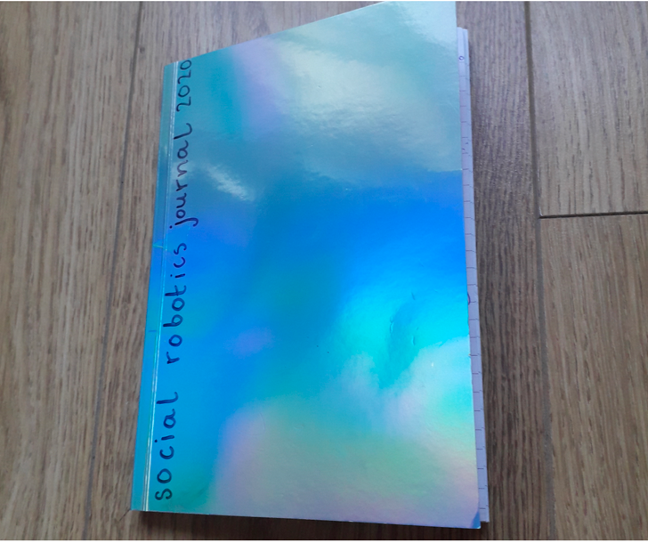

# SocialRobot

We invite you to join us in exploring the ways in which social robotics can support people in creating and discovering their social patterns and needs.

Our master branch contains all the code necessary for a basic set up, input and output. We have tried to make this process as modular as possible, so once you have your basic set up complete you can go wild! Customise your bot by using different sensors/actuators as input/output.
Fork the repository or contribute to the Social-Robotics project.
Our 'projects' branch, includes the various ways participants (including us!) have combined the different elements to best suit our social needs.
For full instructions, background on the project and our stories visit our platform ---> ......

Core team: Wendy, Jasper, Veronika, Pamela.

License Social-Robotics is licensed under the GNU GPL V3 Licence https://www.gnu.org/licenses/gpl-3.0.txt

Contributing Pull requests welcome

Now we're gonna explain to you how you can set up the basic setup of the robot:

# Steps how it work

Begin with a basic setup, which consists of a simple LED protocol, by following the simple step by step instructions provided.  

After that, it’s time to explore input and output sensors and actuators. Here you can really get creative, the possibilities are endless ;) 

Get stuck? No problem! We have set up a forum for any extra support you might need. 

We encourage makers of all skill levels to participate. this is an open community and beginners are more than welcome. 

# Making the robot

## Step 1: Setup Arduino Schematics
With the basic setup your able to let your robots communicate over distance with each other. it a virus. A computer virus. Must go faster. I gave it a cold? I gave it a virus. A computer virus. Did he just throw my ca. it a virus. A computer virus. Must go faster. I gave it a cold? I gave it a virus. A computer virus. Did he just throw my ca.

1.1 [Schematics explained](https://github.com/PamelaAnne/SocialRobot/blob/master/SetupArduinoBoard.md)

1.2 [Setting up in smaller steps](https://github.com/PamelaAnne/SocialRobot/blob/master/MoreStepByStep.md)

## Step 2: Arduino code
With the basic setup your able to let your robots communicate over distance with each other. it a virus. A computer virus. Must go faster. I gave it a cold? I gave it a virus. A computer virus. Did he just throw my ca. it a virus. A computer virus. Must go faster. I gave it a cold? I gave it a virus. A computer virus. Did he just throw my ca

2.1 [Install code](https://github.com/PamelaAnne/SocialRobot/blob/master/InstallCode.md)

2.2 [Change the code to your situation](https://github.com/PamelaAnne/SocialRobot/blob/master/ChangeCode.md)

2.3 [Run code](https://github.com/PamelaAnne/SocialRobot/blob/master/RunCode.md)

2.4 [Error solving](https://github.com/PamelaAnne/SocialRobot/blob/master/ErrorSolving.md)

2.5 [Explain code](https://github.com/PamelaAnne/SocialRobot/blob/master/ExplainBasicCode.md)

## Step 3: Shiftr.io
With the basic setup of Shiftr.io, your robots can communicate with each other over distance. Shiftr.io provides you with the ability to share your data and access data of others. Sharing data publicly is encouraged by the platform's design. In the future, we plan to have additional features that allow more interactions between users and their namespaces.

[Shiftr.io](https://shiftr.io/)

[Shiftr.io explained](https://github.com/PamelaAnne/SocialRobot/blob/master/Shiftr.ioExplained.md)

# Stories
We logged our experiences during the  making and testing of our bots in a daily journal. We noted moments of joy, painpoints and some reflections. Have a look through our stories and feel free to add your own!

[Stories](https://medium.com/connectek)

# What can I reflect on?
Every experience of making and living with the bots will be different; from the features that we decide to implement, to the struggles/triumphs in making and then eventually in how we interact with our personalised bots. 
We encourage you to capture these unique moments and thoughts by keeping a journal and taking pictures. What intregued you about the bot today? What brought you joy? What was frustrating? Any unexpected revelations?

By sharing our experiences we can create a greater collective understanding of how social robotics can have a positive or negative influence in our lives. 

Your social needs are unique and so your story will be too.

