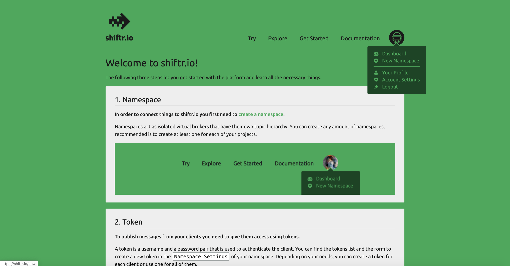
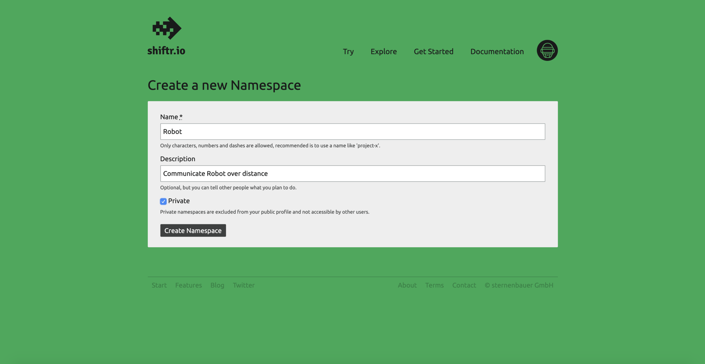
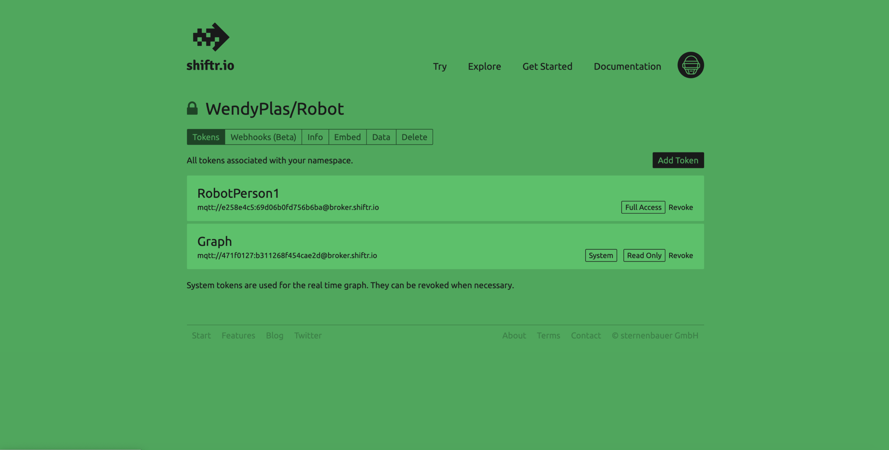
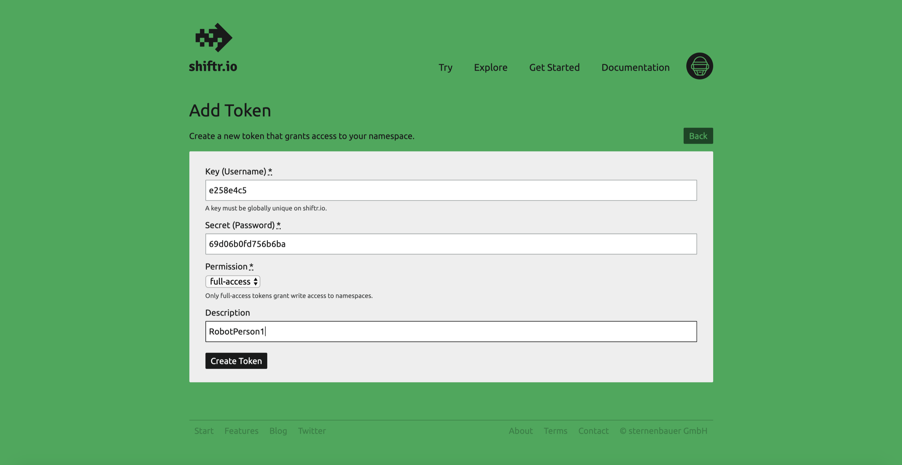
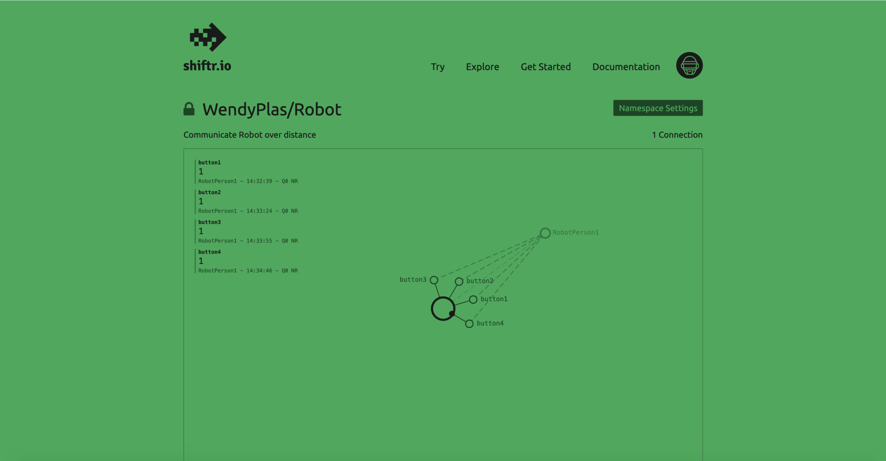

# How does shiftr.io works

https://shiftr.io/get-started

In order to connect things to shiftr.io you first need to create a namespace.





To publish messages from your clients you need to give them access using tokens. 

Fill in your key and secret on lines 10, 11 and 12:

```
const char key[] = ""; 
const char secret[] = "";
const char device[] = "";
```





Finally, you can connect with your client to shiftr.io! 

Here you see signals coming through. 

You can see which person you are on here and the black circle shows you are signaling through.


